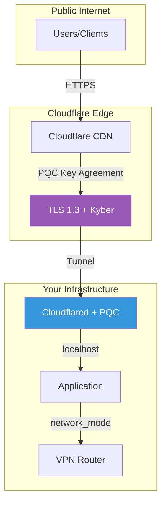

# Abejar Post-Quantum Cryptography VPN Router

<p align="center">
  <strong>Cloudflare Tunnel PQC Edition</strong>
</p>

<p align="center">
  
  
  
</p>

---

## Overview

**Abejar PQC VPN Router (Cloudflare Tunnel Edition)** focuses post-quantum security on the Cloudflare Tunnel ingress layer, using TLS 1.3 with Kyber key agreement.

This variant is ideal when your primary concern is **securing public-facing services** with quantum-resistant encryption at the edge.

### Architecture



### Key Features

- **PQC TLS at Edge** - Quantum-resistant encryption from user to Cloudflare
- **Cloudflare Tunnel** - Secure ingress without exposed ports
- **Zero Trust** - No public IP exposure
- **Easy Setup** - Works with existing Cloudflare infrastructure

## Quick Start

```bash
docker pull ghcr.io/vinzabe/abejar-pqc-cloudflared:latest
git clone https://github.com/vinzabe/abejar-pqc-vpn-cloudflare-tunnel.git
cd abejar-pqc-vpn-cloudflare-tunnel
./scripts/setup.sh
docker compose up -d
```

## PQC TLS Details

Cloudflare's post-quantum TLS implementation uses:

- **Key Agreement**: X25519Kyber768Draft00
- **Cipher Suite**: TLS_AES_256_GCM_SHA384
- **Protocol**: TLS 1.3

## Contact

For full source code and enterprise licensing:

**Email:** grant@abejar.net

---

Copyright 2024 Abejar. All rights reserved.
